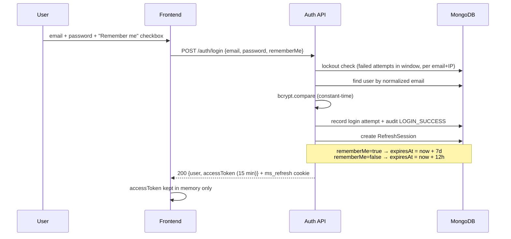
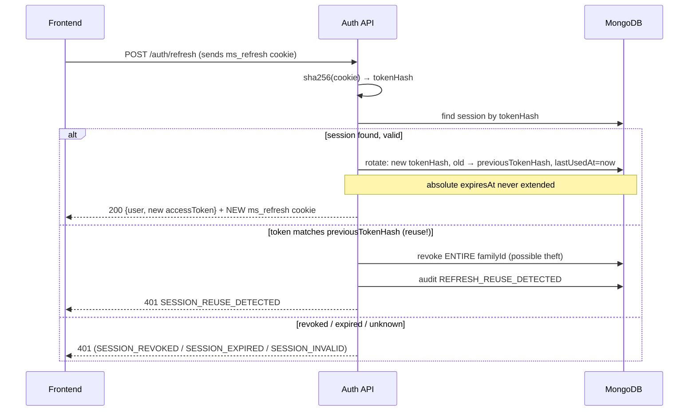
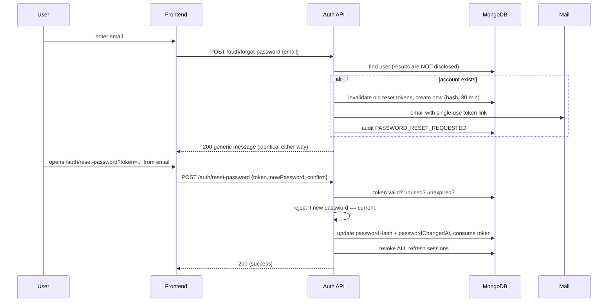
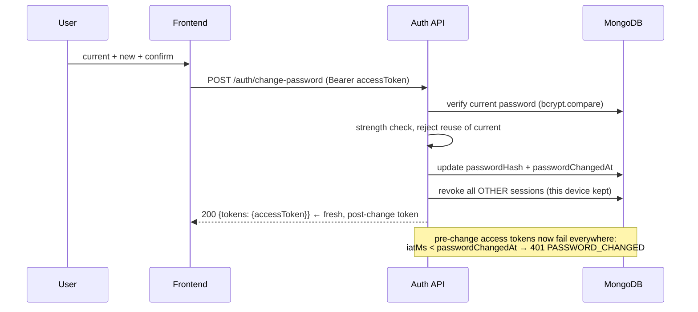

# MeetSpace Authentication — Flow Diagrams

All flows below assume `credentials: 'include'` on the frontend and an
`ms_refresh` HttpOnly cookie. Access tokens live only in memory.

## 1. Signup + email verification

```mermaid
sequenceDiagram
    participant U as User
    participant F as Frontend (React)
    participant A as Auth API
    participant DB as MongoDB
    participant M as Mail (SMTP/console)

    U->>F: Enter name, email, password
    F->>A: POST /auth/signup {name, email, password, rememberMe}
    A->>DB: unique email check (race-safe: unique index)
    A->>A: hash password (bcrypt cost 12)
    A->>DB: create User {passwordHash, emailVerifiedAt: null}
    A->>DB: create EmailVerificationToken (hash only, 24h)
    A->>M: welcome email + verification email (link with token)
    A->>DB: create RefreshSession (hash only; 7d if rememberMe)
    A-->>F: 201 {user, accessToken} + Set-Cookie ms_refresh (HttpOnly)
    F->>U: signed in, "verify your email" banner
    U->>F: clicks link in email → /auth/verify-email?token=...
    F->>A: GET /auth/verify-email?token=...
    A->>DB: token valid? unused? unexpired?
    A->>DB: mark emailVerifiedAt, consume token
    A-->>F: 200 {user: {emailVerified: true}}
```

## 2. Login + Remember Me (7 days)



Access-token lifetime (15 min) is **independent** of the session lifetime:
Remember Me extends the refresh session, never the access token.

## 3. Refresh rotation + reuse detection



## 4. Forgot password → reset



## 5. Change password (authenticated)



## 6. Logout / logout-all

```mermaid
sequenceDiagram
    participant F as Frontend
    participant A as Auth API
    participant DB as MongoDB

    F->>A: POST /auth/logout (ms_refresh cookie)
    A->>DB: revoke session owned by cookie (if any)
    A->>DB: audit LOGOUT
    A-->>F: 200 + cleared cookie

    F->>A: POST /auth/logout-all (Bearer accessToken)
    A->>DB: revoke every session for the user
    A-->>F: 200 + cleared cookie
    Note over F: local state cleared; user lands on sign-in
```

## 7. Session boot (page reload)

```mermaid
sequenceDiagram
    participant F as Frontend
    participant A as Auth API

    F->>F: App boots; no access token in memory (nothing in localStorage)
    F->>A: GET /auth/me (no Bearer → 401)
    F->>A: POST /auth/refresh (cookie) → new access token
    F->>A: GET /auth/me (Bearer) → user
    F->>F: session restored; ProtectedRoute renders
    Note over F: failed refresh → signed-out state, redirect to /auth
```

## Session lifetime summary

| Scenario | Access token | Refresh session |
| --- | --- | --- |
| Login (no Remember Me) | 15 min | 12 h |
| Login (Remember Me) | 15 min | 7 days |
| Refresh (rotation) | 15 min | unchanged (absolute expiry, never extended) |
| Password change | invalidated immediately (iatMs check) | other sessions revoked; current kept |
| Password reset | invalidated immediately | all sessions revoked |
| Logout | cleared from memory | revoked |
| Logout-all | cleared from memory | all revoked |
